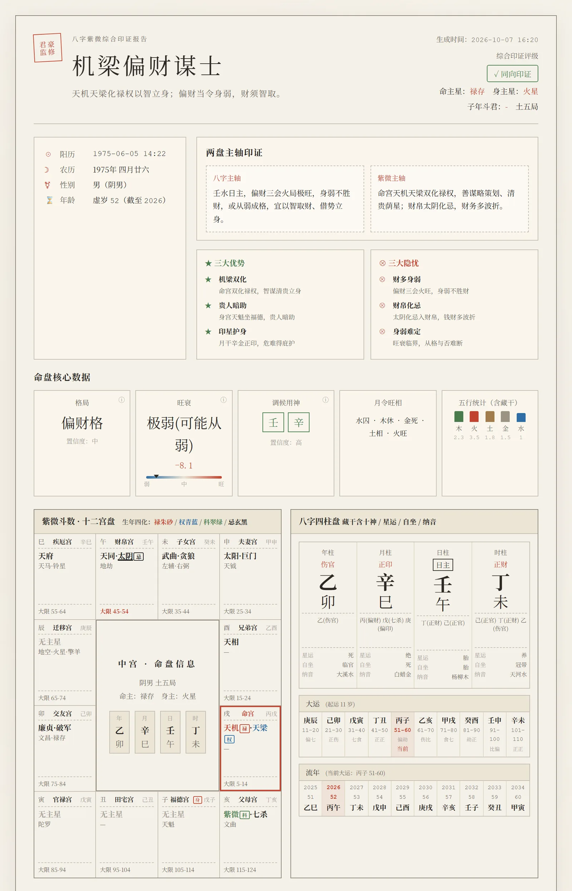
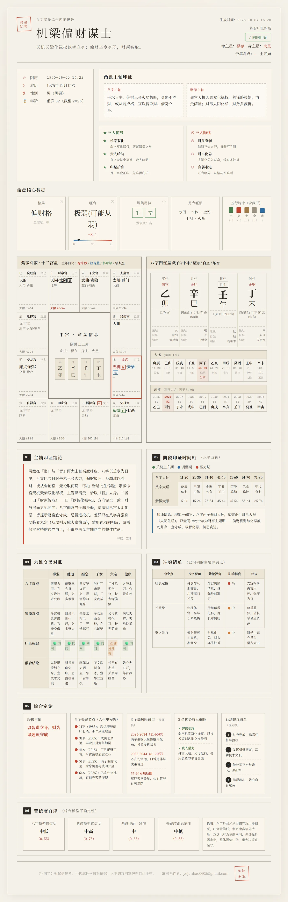

# bazi-ziwei-skills

**AI 四柱推命（八字）＋ 紫微斗数 命盤作成・総合検証 Skill**

精密アルゴリズムによる命盤作成（LLM に推測させない）· 3 つの分析モード · ワンクリックで水墨風 HTML 命盤ポスター


[繁體中文](./README.zh-TW.md) | [简体中文](./README.md) | **日本語** | [English](./README.en.md)

  


<table>
<tr>
<td width="50%">
<a href="./docs/v2-full.png" target="_blank">

</a>
</td>
<td width="50%">
<a href="./docs/v2-full.png" target="_blank">

</a>
</td>
</tr>
</table>

<sub>総合検証ポスターのイメージ（左：概要カードのファーストビュー／右：全体レイアウト全ページ、クリックで拡大）。紫微斗数十二宮盤の朱砂色の枠が「命宮」です——本リポジトリではそのズレのバグを修正済みで、枠は正しい命宮の地支に表示されます。</sub>

---

## これは何か

[SKILL.md オープン標準](https://code.claude.com/docs/en/skills) に準拠した占術分析 Skill です。Claude Code / Claude Desktop / Codex / Cursor / WorkBuddy など、この標準に対応した AI Agent に導入できます。

LLM 単体では苦手な次の 3 つを担います。

1. **精密な命盤作成**：四柱推命の四柱、紫微斗数の十二宮、大運・流年は内蔵のアルゴリズムエンジンが計算し、**LLM 自身に命盤を組ませません**。純粋な LLM による命盤作成は日柱・日主・格局を誤ることが多く、一手の誤りが全体を崩します。
2. **格局補完レイヤー**：命盤の上に「格局（かくきょく）／旺衰（おうすい）／調候（ちょうこう）／刑沖合害（けいちゅうごうがい）／蓋頭截脚（がいとうせっきゃく）」のアルゴリズム層を重ね、LLM が根拠ある分析を行えるようにします。
3. **総合検証**：四柱推命と紫微斗数という 2 つの独立した体系の結論を突き合わせます——主軸は一致するか、人生の節目は揃うか、矛盾したときはどちらを採るか。

## ✨ 特徴

- 🎯 **高精度アルゴリズム**：命盤の中核はオープンソースの mingpan（四柱推命、Apache-2.0）＋ iztro（紫微斗数、MIT）に基づき、実測で整合を確認。補完レイヤーは 7 ケースで多次元回帰検証済み
- 🧭 **3 つの分析モード**：四柱推命のみ／紫微斗数のみ／四柱推命＋紫微斗数の総合検証
- 📜 **2 つの出力形式**：Markdown 長文の詳細版 ＋ 🎴 単一ファイル HTML ポスター版（総合検証専用）
- 🖼️ **水墨風の命盤ポスター**：モダンミニマル × 中国水墨の美学。紫微十二宮盤＋四柱盤＋六次元クロスチェックを収録し、スクリーンショット共有に最適
- 🐛 **表示レイヤーのバグ修正済み**：命宮の赤枠／命主星／テキスト命盤が「寅（官禄宮）」に誤表示される問題を修正し、正しい命宮地支に（[PR #1](https://github.com/junhao-ye/bazi-ziwei-skills/pull/1)）
- 🛠️ **クロス Agent 対応**：1 つの SKILL.md で主要な Agent に対応
- 🔒 **プライバシー優先**：命盤作成はすべてローカルで完結、ネットワーク不要。実行生成物は既定で gitignore

## 🚀 インストール

```bash
git clone git@github.com:junhao-ye/bazi-ziwei-skills.git
cd bazi-ziwei-skills/calculator
npm install
```

> `git clone` が HTTPS で通らない場合は SSH をご利用ください（上記コマンド）。

その後、このディレクトリを各 Agent に登録します（各 Agent の SKILL.md 読み込み方法を参照）。

## 💡 使い方

詳細は [SKILL.md](./SKILL.md) を参照してください。

**導入後に自動セルフチェックは行いません**——導入が済んだらそれで完了。ユーザーが生辰（生年月日時）を提示してから動作を開始します。

生辰を提示すると、Skill はまずどの分析を行うか（四柱推命／紫微斗数／総合検証）を尋ね、選択に応じて処理を進めます。

```bash
cd calculator

# Step 1 命盤作成（chart.json を出力）
npx tsx run-chart.ts --year=2000 --month=1 --day=1 --hour=12 --minute=0 --gender=male > chart.json

# Step 2 テキスト命盤へ変換（chart.txt を出力）
npx tsx dump-text.ts --input=chart.json --output=chart.txt

# Step 3（総合検証ポスター）HTML をレンダリング
npx tsx render.ts --chart=chart.json --analysis=analysis.json \
  --template=../templates/report-zonghe-poster.html \
  --output=report.html --currentYear=2026
```

Agent を介さず、コマンドラインから直接命盤作成することも可能です。

## 📁 ディレクトリ構成

```
├── SKILL.md              ← Skill 定義（発動条件、実行フロー）
├── calculator/           ← 命盤エンジン（mingpan 四柱推命 ＋ iztro 紫微斗数 ＋ enrichBazi 補完層）
│   ├── run-chart.ts      ← 命盤作成の入口：生辰 → JSON
│   ├── dump-text.ts      ← JSON → 文墨天機風のテキスト命盤
│   ├── render.ts         ← chart.json ＋ analysis.json ＋ テンプレート → HTML
│   ├── engine/           ← 命盤エンジンのアダプタ層
│   └── bazi-enrich/      ← enrichBazi 補完層（格局／旺衰／調候／関係／整柱）
├── prompts/              ← 分析プロンプト（四柱／紫微／総合検証／ポスター JSON）
└── templates/            ← ポスターテンプレートとデザイン仕様
```

## 🏗️ 仕組み

```
命盤作成（アルゴリズム層、決定論的計算）
  → テキスト命盤変換（構造化テキスト）
  → LLM 分析（プロンプトに沿って結論を生成）
  →（任意）HTML ポスターをレンダリング
```

**設計の要点**：LLM は「分析」のみを担当し、「命盤作成」と「HTML 描画」は行いません。命盤作成は決定論的アルゴリズムが、HTML の視覚表現は固定テンプレートが担い、LLM が出力した構造化データがテンプレートのスロットに流し込まれます——各層が役割を分離し、互いを汚染しません。

## 🙏 謝辞

- 四柱推命の中核アルゴリズム：[mingpan](https://github.com/ChesterRa/mingpan)（Apache-2.0）
- 紫微斗数の中核アルゴリズム：[iztro](https://github.com/SylarLong/iztro)（MIT）
- 旧暦日付変換：[lunar-typescript](https://github.com/6tail/lunar-typescript)（MIT）

## ⚠️ 免責事項

本分析は伝統的な四柱推命および紫微斗数の理論枠組みに基づくもので、文化研究および娯楽目的に限られます。医療・投資・婚姻・法律など、いかなる意思決定の根拠にもなりません。運命は個人の選択と客観的環境によって共に形作られるものです。

## 📄 License

本プロジェクトは [MIT License](./LICENSE) の下で公開されています。
