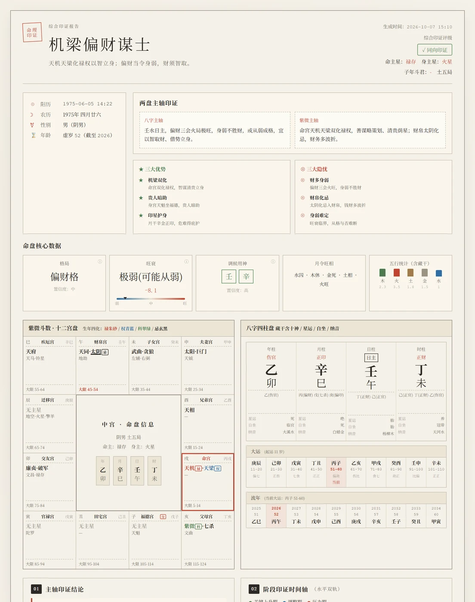
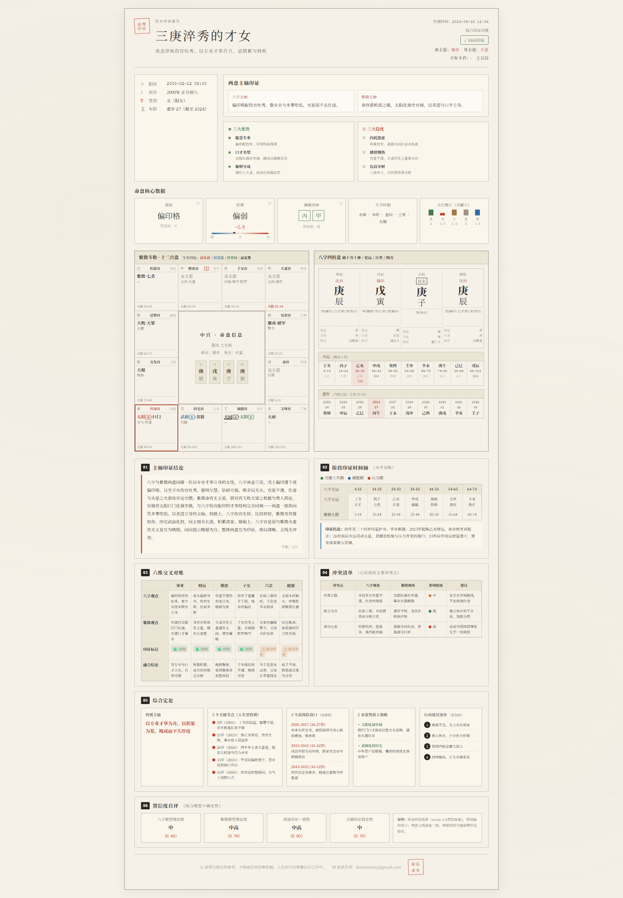

# bazi-ziwei-skills

**AI 八字（四柱）＋ 紫微斗數 排盤與綜合印證 Skill**

精準演算法排盤（不讓 LLM 猜）· 三種分析模式 · 一鍵生成水墨風 HTML 命盤海報

[](./LICENSE)


**繁體中文** | [简体中文](./README.md) | [日本語](./README.ja.md) | [English](./README.en.md)

<br>

<table>
<tr>
<td width="50%">
<a href="./docs/poster-full.png" target="_blank">

</a>
</td>
<td width="50%">
<a href="./docs/jietu.png" target="_blank">

</a>
</td>
</tr>
</table>

<sub>綜合印證海報示意（左：速覽卡首屏；右：完整版式）。注意紫微十二宮盤中朱砂紅框標註的「命宮」——本倉庫已修復其錯位 bug。</sub>

---

## 這是什麼

一個遵循 [SKILL.md 開放標準](https://code.claude.com/docs/en/skills) 的命理分析 Skill，可裝入 Claude Code / Claude Desktop / Codex / Cursor / WorkBuddy 等支援該標準的 AI Agent。

它做大模型單獨做不好的三件事：

1. **精準排盤**：八字四柱、紫微十二宮、大運流年由內建演算法庫計算，**不讓 LLM 自己排**——純 LLM 排盤常把日柱、日主、格局算錯，一步錯則全盤失真。
2. **格局補層**：在排盤之上補一層「格局／旺衰／調候／刑沖合害／蓋頭截腳」演算法，餵給 LLM 做有依據的分析。
3. **綜合印證**：把八字與紫微兩套獨立體系的結論做交叉對帳——主軸是否一致、人生窗口是否對齊、衝突時聽誰。

## ✨ 特性

- 🎯 **演算法精準**：排盤核心源自開源專案 mingpan（八字，Apache-2.0）＋ iztro（紫微，MIT），經實測對齊；補層演算法經 7 組案例多維度回歸驗證
- 🧭 **三種分析模式**：八字獨立／紫微獨立／八字＋紫微綜合印證
- 📜 **兩種呈現形態**：Markdown 長文深度版 ＋ 🎴 單檔 HTML 海報版（綜合印證專享）
- 🖼️ **水墨風命盤海報**：現代極簡 × 中式水墨，含紫微 12 宮盤＋八字四柱盤＋六維交叉對帳，可截圖分享
- 🐛 **已修復顯示層 bug**：命宮紅框／命主星／文本盤曾誤落「寅（官祿宮）」，現已修正為正確命宮地支（[PR #1](https://github.com/junhao-ye/bazi-ziwei-skills/pull/1)）
- 🛠️ **跨 Agent**：一份 SKILL.md，多個主流 Agent 通用
- 🔒 **隱私優先**：所有排盤在本機完成，無需聯網；執行產物預設 gitignore

## 🚀 安裝

```bash
git clone git@github.com:junhao-ye/bazi-ziwei-skills.git
cd bazi-ziwei-skills/calculator
npm install
```

> 若 `git clone` 走 HTTPS 不通，改用 SSH（見上方指令）。

接著把這個目錄註冊到你的 Agent（參考各 Agent 的 SKILL.md 載入方式）。

## 💡 使用

詳見 [SKILL.md](./SKILL.md)。

**安裝後不主動自檢**——裝好即是裝好，等使用者提供生辰再開始工作。

提供生辰後，Skill 會先問你要哪種分析（八字／紫微／綜合印證），再依選擇走對應流程：

```bash
cd calculator

# Step 1 排盤（產出 chart.json）
npx tsx run-chart.ts --year=2000 --month=1 --day=1 --hour=12 --minute=0 --gender=male > chart.json

# Step 2 轉文本盤（產出 chart.txt）
npx tsx dump-text.ts --input=chart.json --output=chart.txt

# Step 3（綜合印證海報）渲染 HTML
npx tsx render.ts --chart=chart.json --analysis=analysis.json \
  --template=../templates/report-zonghe-poster.html \
  --output=report.html --currentYear=2026
```

也可以完全不經 Agent，直接用命令列排盤。

## 📁 目錄結構

```
├── SKILL.md              ← Skill 定義（觸發條件、執行流程）
├── calculator/           ← 排盤引擎（mingpan 八字＋iztro 紫微＋enrichBazi 補層）
│   ├── run-chart.ts      ← 排盤入口：生辰 → JSON
│   ├── dump-text.ts      ← JSON → 文墨天機風文本盤
│   ├── render.ts         ← chart.json ＋ analysis.json ＋ 模板 → HTML
│   ├── engine/           ← 排盤引擎適配層
│   └── bazi-enrich/      ← enrichBazi 補層（格局／旺衰／調候／關係／整柱）
├── prompts/              ← 分析提示詞（八字／紫微／綜合印證／海報 JSON）
└── templates/            ← 海報模板與設計規範
```

## 🏗️ 工作原理

```
排盤（演算法層，確定性計算）
  → 文本盤轉換（結構化文本）
  → LLM 分析（按提示詞產出結論）
  →（可選）渲染 HTML 海報
```

**關鍵設計**：LLM 只負責「分析」，不負責「排盤」和「畫 HTML」。排盤交給確定性演算法，HTML 視覺交給固定模板，LLM 產出的結構化內容填進模板槽位——三者各司其職，互不污染。

## 🙏 致謝

- 八字排盤核心演算法：[mingpan](https://github.com/ChesterRa/mingpan)（Apache-2.0）
- 紫微斗數排盤核心演算法：[iztro](https://github.com/SylarLong/iztro)（MIT）
- 農曆日期轉換：[lunar-typescript](https://github.com/6tail/lunar-typescript)（MIT）

## ⚠️ 免責聲明

本分析基於傳統八字與紫微斗數理論框架，僅供文化研究與娛樂參考，不構成醫療、投資、婚姻、法律等任何決策依據。命運由個人選擇與客觀環境共同塑造。

## 📄 License

本專案採用 [MIT License](./LICENSE) 開源協議。
